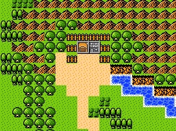
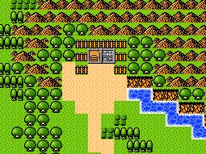

# MetalMax Re

    这是一个FC游戏 MetalMax 的编辑器

### 编辑器完成度

    TreasureEditor          宝藏编辑器 √
    MapBuilder              地图构建器 √
    MapEditor               地图编辑器 × 半成品
    MapPropertiesEditor     地图属性编辑器 √
    ComputerEditor          计算机编辑器 √
    DogSystemEditor         犬系统 √
    VendorEditor            售货机编辑器 √ 后续考虑添加功能
    EventTilesEditor        事件图块编辑器 √
    SpriteEditor            精灵编辑器 √
    MapEntranceEditor       地图边界和出入口编辑器 √
    PlayerEditor            玩家编辑器 √ 后续考虑添加功能
    TankEditor              坦克编辑器 √ 后续考虑添加功能
    PlayerExperienceEditor  玩家升级所需经验值编辑器 √
    PaletteEditor           调色板编辑器 √
    ItemsEditor             物品编辑器 √ 后续考虑添加功能
    TextEditor              文本编辑器 √ 文本源后续继续添加测试
    TileSetEditor           图块编辑器 √ 后续考虑添加功能
    WorldMapEditor          世界地图编辑器 √ 后续考虑优化
    MonsterEditor           怪物编辑器 ... 卡关了。。。

    其它

## 注意

> 没有经过修改版的作者同意，禁止使用本程序将修改内容发布到任何地方

### 使用

请确保已经安装了`java 16`或以上的版本

如果需要可视化界面（未完成），可以添加 `gui` 参数，如下：

~~~bash
java -jar metalmaxre.jar gui
~~~

### 下载

无法给出可以用的版本，所以暂不提构建的jar

### 构建环境

```java 16```

## 编辑器可编辑内容

### [TreasureEditor](src/main/java/me/afoolslove/metalmaxre/editor/treasure/TreasureEditor.java)（宝藏编辑器）

支持世界地图

* 宝藏坐标、所在地图和物品

注：宝箱的图像因地图图块组成不同而不同，世界地图为隐藏显示

### [MapEditor](src/main/java/me/afoolslove/metalmaxre/editor/map/MapEditor.java)（地图编辑器）

不支持世界地图，世界地图请使用 ```WorldMapEditor```

* 通过 ```MapBuilder``` 可以构建或编辑所有地图

注：暂时未解决如何在有限的空间里提搞空间利用率

### [MapPropertiesEditor](src/main/java/me/afoolslove/metalmaxre/editor/map/MapPropertiesEditor.java)（地图属性编辑器）

支持编辑世界地图的部分属性 ```WorldMapProperties```

* 地图的宽高、玩家可移动区域、玩家可移动区域偏移量
* 精灵调色板、精灵图像
* 地图图块数据和地图图块数据的组合数据
* 隐藏图块、填充图块、门后图块、背景音乐
* 地图边界和出入口坐标
* 特殊属性：动态图块、事件图块、地下地图

### [ComputerEditor](src/main/java/me/afoolslove/metalmaxre/editor/computer/ComputerEditor.java)（计算机编辑器）

不支持世界地图，世界地图也不支持使用计算机  
计算机包含：售货机、游戏机、计算机等

* 计算机坐标、所在地图和类型

### [DogSystemEditor](src/main/java/me/afoolslove/metalmaxre/editor/map/DogSystemEditor.java)（犬系统编辑器）

* 将某个地图设置为城镇
* ~~某个地图作为附属城镇（进入附属城镇相当于进入城镇）~~
* 使用“传真”传送时的目的地坐标，目的地只能是世界地图
* 使用机器传送时的目的地坐标，支持世界地图

### [VendorEditor](src/main/java/me/afoolslove/metalmaxre/editor/computer/vendor/VendorEditor.java)（售货机商品编辑器）

不支持世界地图，世界地图也不支持使用售货机

* 售货机的商品、商品数量和所在地图，修改商品价格请使用 ```ItemsEditor```

### [EventTilesEditor](src/main/java/me/afoolslove/metalmaxre/editor/map/events/EventTilesEditor.java)（事件图块编辑器）

支持世界地图  
地图的比例为：1:1tile  
世界地图图块的比例为：1:4*4tile

事件图块需要在 ```MapPropertiesEditor``` 种启用，世界地图默认启用

* 通过某个事件将某个地图的某个位置的图块替换为某个图块（？）

### [SpriteEditor](src/main/java/me/afoolslove/metalmaxre/editor/sprite/SpriteEditor.java)（精灵编辑器）

* 精灵的类型、坐标、对话和行动方式
* 特殊属性：可被推动、无视地形移动、锁定朝向、移动时不播放移动动画（平移）

### [MapEntranceEditor](src/main/java/me/afoolslove/metalmaxre/editor/map/MapEntranceEditor.java)（地图出入口编辑器）

支持世界地图

* 移动到地图边界时传送的目的地：固定目的地、根据朝向不同而不同的目的地和回到上一个地图
* 地图入口和出口坐标

### [PlayerEditor](src/main/java/me/afoolslove/metalmaxre/editor/player/PlayerEditor.java)（玩家编辑器）

* 玩家的初始金钱
* 玩家的初始属性
* 玩家的初始装备
* 玩家的初始道具

### [TankEditor](src/main/java/me/afoolslove/metalmaxre/editor/tank/TankEditor.java)（坦克编辑器）

包含出租坦克

* 坦克的初始装备
* 坦克的初始属性
* 坦克的初始装甲片

### [PlayerExperienceEditor](src/main/java/me/afoolslove/metalmaxre/editor/player/PlayerExperienceEditor.java)（玩家经验值编辑器）

* 玩家到达某一等级所需的经验（不是差值）

注：只能编辑2-99级

### [PaletteEditor](src/main/java/me/afoolslove/metalmaxre/editor/palette/PaletteEditor.java)（调色板编辑器）

包含战斗时的精灵调色板

注：编辑配色请使用 ```ColorTool```

### [ItemsEditor](src/main/java/me/afoolslove/metalmaxre/editor/items/ItemsEditor.java)（物品编辑器）

* 物品的价格
* 玩家的防具属性 ```PlayerArmor```
* 玩家的武器属性 ```PlayerWeapon```
* 坦克的装备属性 ```TankEquipmentItem``` ```TankEngine```
* 坦克的武器属性 ```TankWeapon```

### [TextEditor](src/main/java/me/afoolslove/metalmaxre/editor/text/TextEditor.java)（文本编辑器）

* 多

### [TileSetEditor](src/main/java/me/afoolslove/metalmaxre/editor/map/tileset/TileSetEditor.java)（图块集编辑器）

* 地图的图块和图块组合数据
* 地图的图块属性

### [WorldMapEditor](src/main/java/me/afoolslove/metalmaxre/editor/map/world/WorldMapEditor.java)（世界地图编辑器）

* 编辑世界地图

### [MonsterEditor](src/main/java/me/afoolslove/metalmaxre/editor/monster/MonsterEditor.java)（怪物编辑器）

未完成

* 怪物的掉落物
* 怪物的部分属性
* 怪物的组合方式
* 怪物组合在地图和世界地图上的分布

**和其它未提及的小功能数据修改**

# Tiled 

## Script

### [Format Peak](tiled/script/FormatPeak.js)（格式化山脉）
Restore Script: [Format Peak Restore](tiled/script/FormatPeakRestore.js)  
Menu: Map -> Format Peak

可以将导出的 tmx世界地图 中的山脉格式化为游戏中的样子  


## objecttypes
Menu: View -> Object Types Editor -> Import  
Select [this](tiled/objecttypes.xml) xml file to import  
导入后可以简便的修改精灵和图块集中的图块属性（注：需要设置type